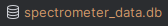
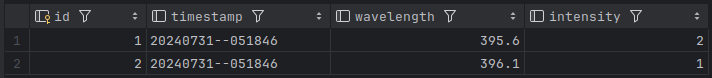

# How to Use the PySpectrometer DB Module

## Requirements:
1. Update, install, and upgrade pip:
   ```shell
   sudo apt update
   sudo apt install python3-pip
   pip3 --version
   sudo pip3 install --upgrade pip
   ```
2. Set up the .env file:
   ```shell
   sudo cp src/.env.example src/.env
   ```

## Installation:
1. Create a new virtual environment:
   ```shell
   python3 -m venv .venv
   ```
2. Activate the virtual environment:
   ```shell
   source .venv/bin/activate
   ```
3. Install requirements in the virtual environment:
   ```shell
   pip3 install -r requirements.txt
   ```

## Initialize Database:
### Local / Development Environment:
1. Run the `db.py` module with the initialize argument:
   ```shell
   python3 src/db.py --initialize
   ```
   > This creates a new local SQLite3 database in the root folder of this project.  
   
2. Run the `db.py` module again with the test argument:
   ```shell
   python3 src/db.py --test
   ```
   > This will create two test entries in the newly created database in the `measurements` table.  
   You can delete them after verifying that it works.  
   

### Production Environment:
> Coming soon...

Now, if you run any of the PySpectrometer2 scripts, it should, based on the DB_TYPE (`sqlite3`, `postgresql`) from the .env file, select the correct database and write data to the database whenever a new .csv file is generated.
